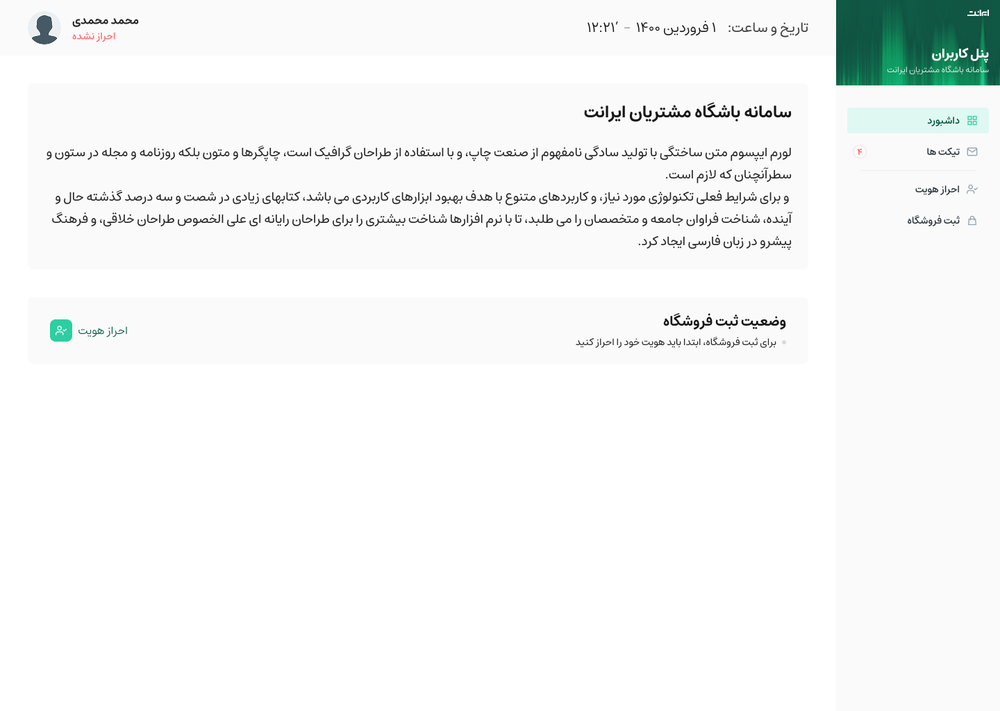
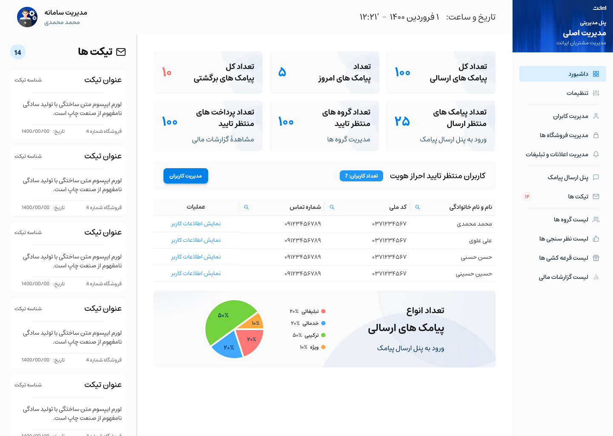
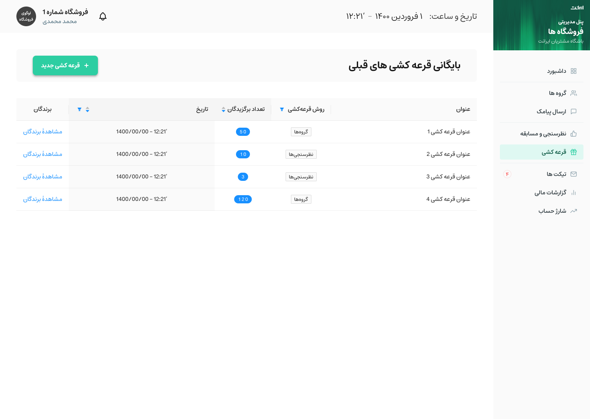
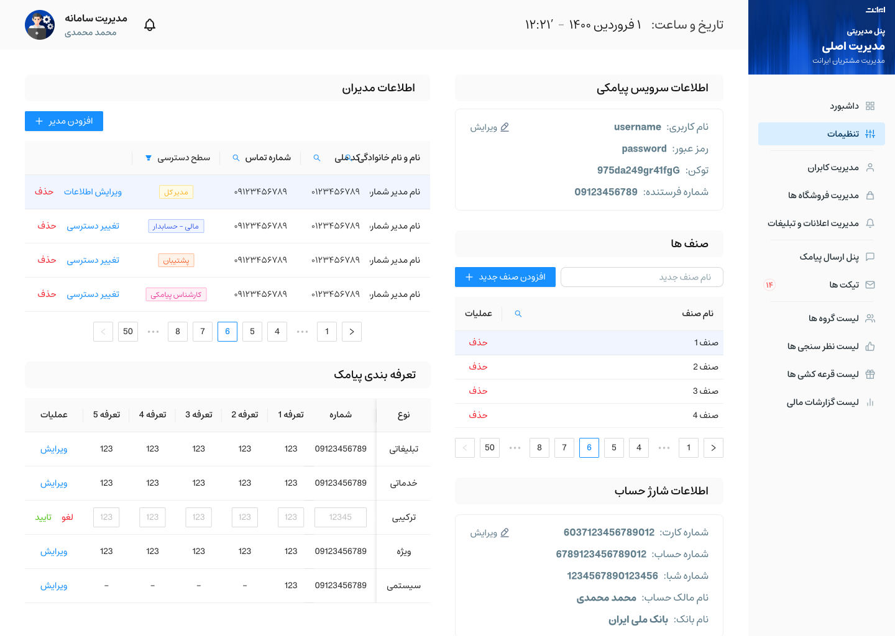
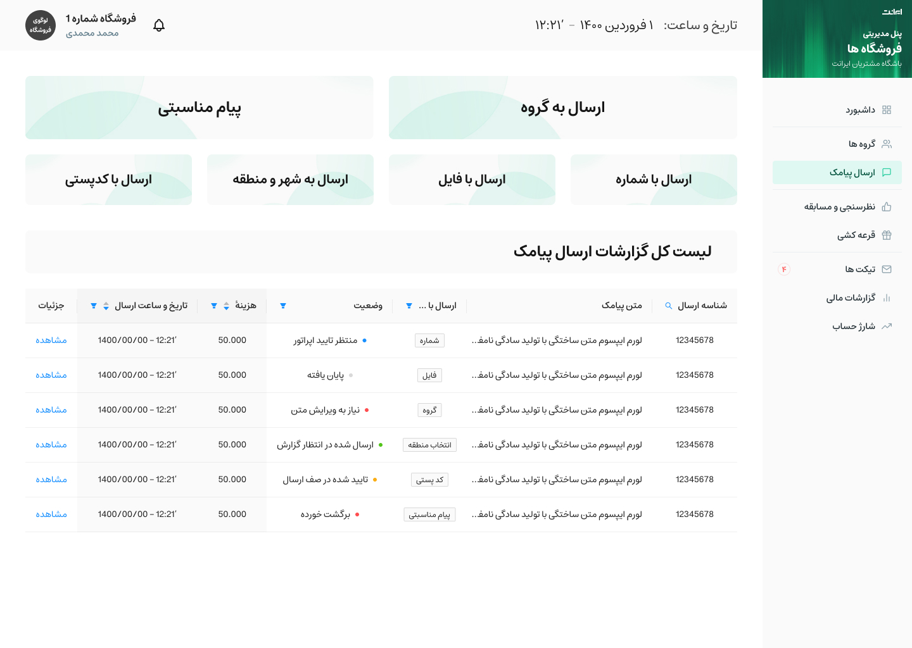
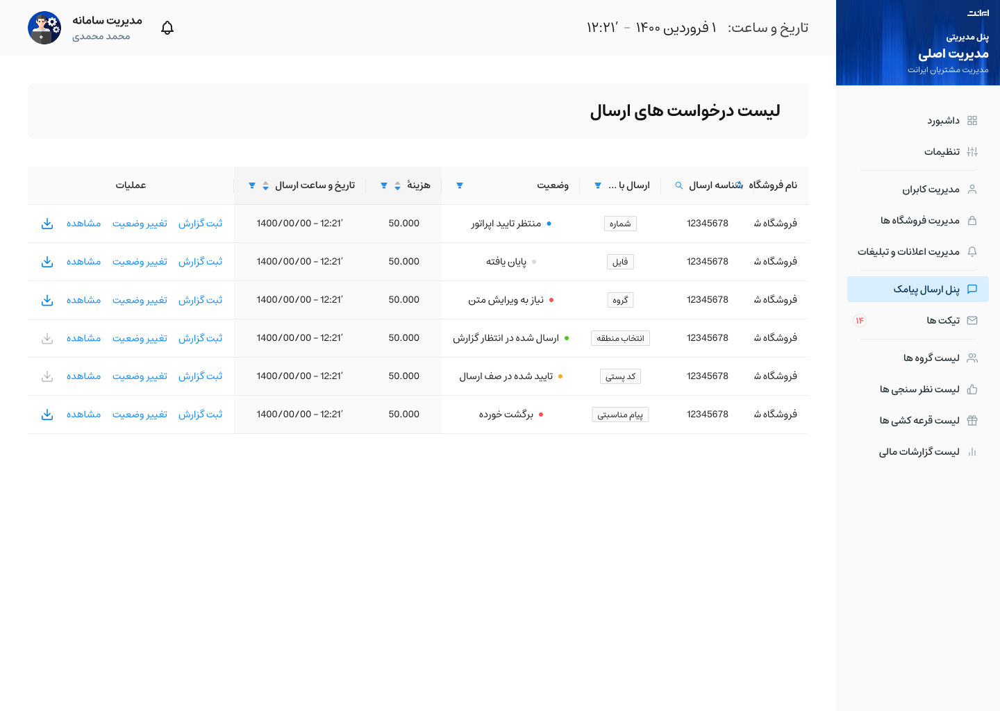

# 🌐 Iranet | سامانه جامع مدیریت شبکه و زیرساخت چندمجموعه‌ای

<strong>Iranet</strong> یک پلتفرم Enterprise-grade برای مدیریت زیرساخت‌های شبکه، تجهیزات و کاربران در محیط‌های چندمجموعه‌ای (Multi-Tenancy) است. این سیستم به مدیران کل اجازه می‌دهد تا چندین مجموعه (ISPها، سازمان‌ها یا مجتمع‌ها) را مدیریت کنند و به هر مجموعه، پنل مدیریت مستقل، کاربران و تجهیزات اختصاص دهند.

> ⚠️ **توجه:** کدهای منبع به دلیل محرمانه بودن پروژه اصلی، در اینجا موجود نیستند. این مخزن شامل مستندات فنی، معماری و دموهای وب‌سایت است.

---

## 🚀 ویژگی‌های کلیدی و معماری

### 🏢 مدیریت چندمجموعه‌ای (Multi-Tenancy)
*   **ایزولاسیون کامل داده‌ها:** هر مجموعه (Organization) داده‌های کاملاً مجزایی از کاربران، تجهیزات و صورت‌حساب‌ها دارد.
*   **پنل مدیریت مستقل:** هر مجموعه دارای پنل مدیریتی اختصاصی با دسترسی‌های محدود به دامنه خود است.
*   **سطوح دسترسی سلسله‌مراتبی:** مدیریت سلسله‌مراتبی از `SuperAdmin` (مدیر کل سایت) تا `OrgAdmin` (مدیر مجموعه) و `Technician` (تکنسین).

### 🖥️ مدیریت زیرساخت و تجهیزات (Asset Management)
*   **ردیابی تجهیزات:** ثبت و مدیریت سوییچ‌ها، روترها، پچ‌پنل‌ها و کابل‌ها با وضعیت لحظه‌ای.
*   **اختصاص منابع:** اتصال تجهیزات به پورت‌های خاص و اختصاص آن‌ها به کاربران یا سازمان‌ها.
*   **پایش وضعیت:** مشاهده آنلاین/آفلاین بودن تجهیزات و لاگ‌های خطا.

### 💰 مدیریت پلن‌ها و مالی
*   **تعریف پلن‌های متنوع:** امکان ایجاد پلن‌های اینترنتی با مشخصات مختلف (سرعت، حجم، قیمت).
*   **اتوماسیون مالی:** محاسبه خودکار قبوض و مدیریت وضعیت پرداخت کاربران.
*   **گزارش‌گیری پیشرفته:** آمار مصرف پهنای باند، درآمد هر مجموعه و آمار تجهیزات.

---

## 🛠️ تکنولوژی‌ها و ساختار فنی

این پروژه با رعایت اصول **Clean Architecture** و الگوی **Service-Repository** ساخته شده است:

| لایه | تکنولوژی | توضیحات فنی |
| :--- | :--- | :--- |
| **Core** | Python 3.9+, Django 4.x | هسته اصلی اپلیکیشن وب |
| **API** | Django REST Framework (DRF) | پیاده‌سازی RESTful APIs برای فرانت‌اند و اپلیکیشن‌ها |
| **Database** | PostgreSQL | مدیریت روابط پیچیده و داده‌های حجیم با استفاده از Foreign Keys و Indexes |
| **Auth** | Django Allauth / JWT | احراز هویت پیشرفته با پشتیبانی از ورود چندمرحله‌ای |
| **Async** | Celery + Redis | پردازش وظایف پس‌زمینه (مثل ارسال اعلان‌ها و گزارش‌گیری‌های سنگین) |
| **Docs** | Swagger / Redoc | مستندسازی کامل APIها |

---

## 📸 دمو و اسکرین‌شات‌ها

### 1. داشبورد کاربر

### 2. داشبورد مدیریت

### 3. صفحات دیگه

---
